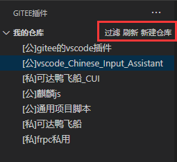
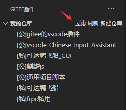
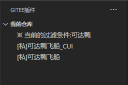

# Change Log

本文件基于 [Keep a Changelog 规范](https://keepachangelog.com/zh-CN/1.0.0/).

本项目遵循 [语义化版本](https://semver.org/lang/zh-CN/).

本文件使用`中文`编写,术语对照表:

```text
增加 Added 新添加的功能。
修改 Changed 对现有功能的变更。
弃用 Deprecated 已经不建议使用，准备很快移除的功能。
移除 Removed 已经移除的功能。
修复 Fixed 对bug的修复。
安全 Security 对安全的改进。
```

## [待发布]

## [0.1.4]

- 修复: 更新vscode商店的readme.

## [0.1.3]

- 修复: 创建项目时会使用用户输入的项目名称了.

## [0.1.2]

- 修复: 修改配置后不需要重启vscode.

## [0.1.1]

- 修复: windows 中配置下载路径不会被正确解析. 现在直接复制文件资源管理器的地址就可以了.
- 修复: 当下载路径为空时会报错, 现在为空时会解析为 `${process.env.HOME || process.env.USERPROFILE}/gitee`, 即用户家目录的`gitee`文件夹.

## [0.1.0]

- 修复: 名称过滤现在会忽略大小写.
- 修复: 输入的过滤条件会将前后的空格去掉.
- 移除: 右键菜单中不再包含`刷新`和`新建仓库`选项, 因为显得有点乱, 这些功能都在`导航`中提供, 就不重复了.



## [0.0.19]

- 修复: 过滤选择时按esc应该什么都不做

## [0.0.18]

- 修复: 调整提示的格式
- 修复: 过滤选择时按esc会将过滤词设为undefined的错误

## [0.0.17]

- 修复: Change Log格式
- 增加: 名称过滤器





## [0.0.16]

- 修复: 完善文档

## [0.0.15]

- 修复: Change Log格式
- 修复: 完善文档

## [0.0.14]

- 修改: 对于`打开在vscode`选项,以前是在`当前窗口`打开,现在则会`新建一个vscode`打开.

## [0.0.13]

- 修复: 完善文档

## [0.0.12]

- 增加: 插件说明,插件描述,插件图标.(感谢 @吴烜)

## [0.0.11]

- 修复: 在刷新时显示`加载中`字样,原来只是第一次刷新会有,现在每次刷新都会有了.


## [0.0.10]

- 修复: 文档中的拼写错误

## [0.0.9]

- 修复: 文档中的拼写错误

## [0.0.8]

- 修复: 完善文档

## [0.0.7]

- 修复: 完善文档

## [0.0.6]

- 修复: 可以获得完整地址了
- 增加: 仓库排序选项

## [0.0.5]

- 修复: 项目用唯一 id 标识
- 修复: 删除调试提示

## [0.0.4]

- 修复: 新建项目后要刷新仓库列表

## [0.0.3]

- 修复: 新建项目后要刷新仓库列表

## [0.0.2]

- 更新: readme

## [0.0.1]

- 发布
