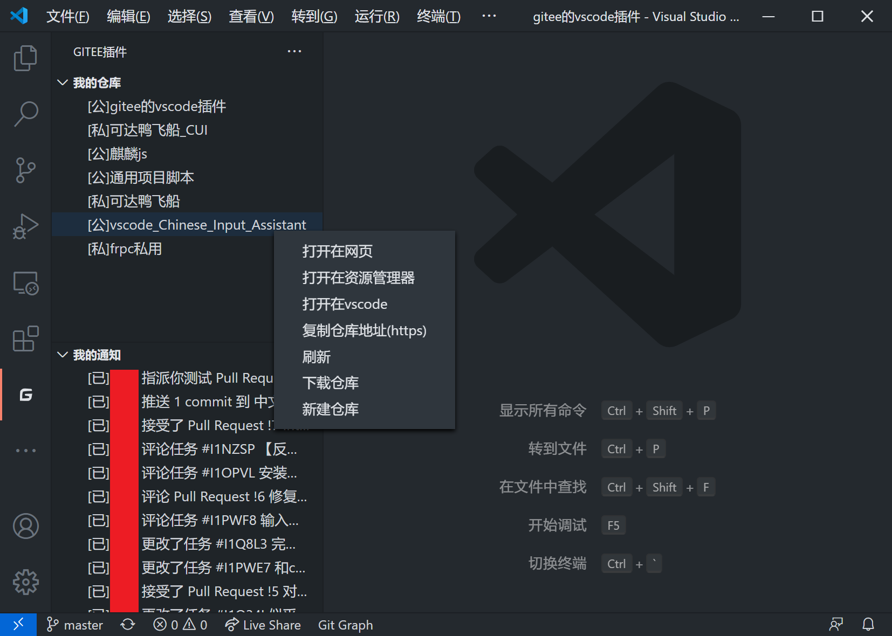
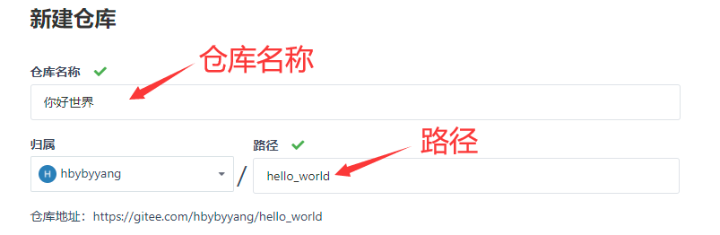

# 码云（Gitee）常用功能

[Gitee 项目地址](https://gitee.com/hbybyyang/gitee_vscode_plugin)

显示通知、仓库，支持相关快捷操作。包括下载、新建、显示现有仓库、在 VS Code 或资源管理器中打开等等。

## 效果

## 使用说明

1.添加一个`私人令牌`

2.添加令牌设置

3.重启 VS Code

## 已知问题

在网页上，可以使用中文作为`仓库名称`，但码云提供的 API 并不能用中文。

所以这里使用`路径名称`作为`仓库名称`。已发邮件反馈，等待回复。

## 其他

- 欢迎意见和建议
- 欢迎pr

## 相关

[g8up/vscode-gitee](https://gitee.com/g8up/vscode-gitee)

## [Change Log](https://gitee.com/hbybyyang/gitee_vscode_plugin/blob/master/CHANGELOG.md)
