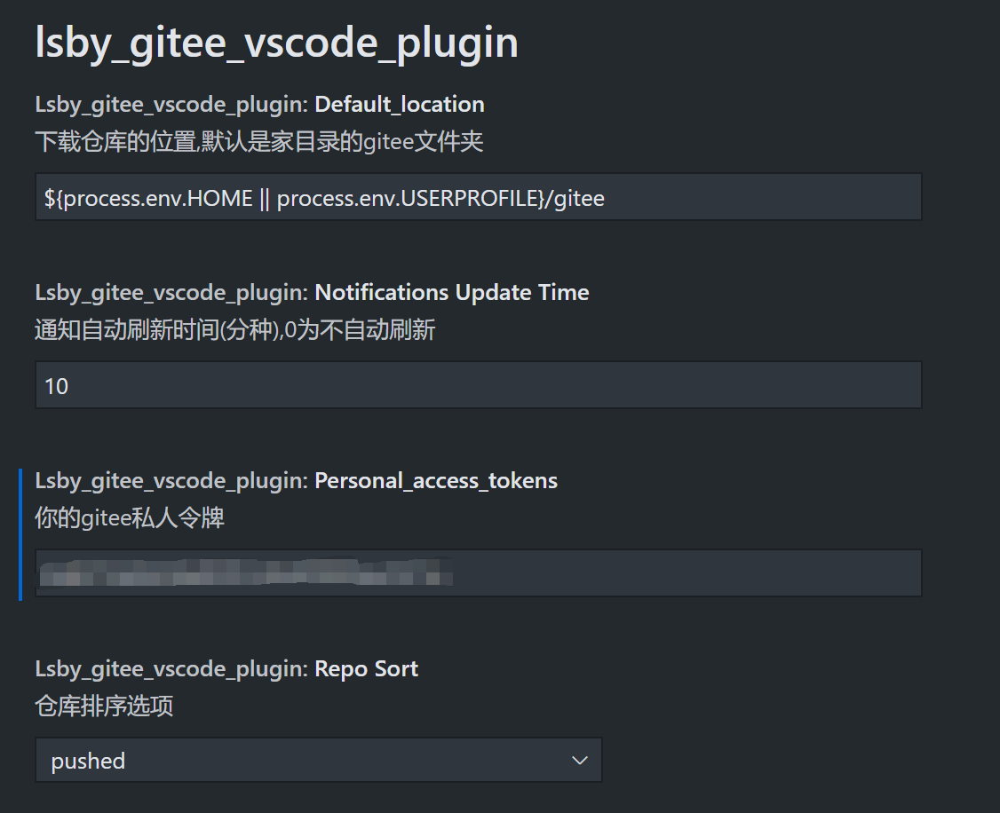

# gitee的vscode插件

gitee 的 vscode 插件!

## 功能

## 安装

[vscode商店](https://marketplace.visualstudio.com/items?itemName=hbybyyang.gitee-vscode-plugin)

## 相关

<https://gitee.com/g8up/vscode-gitee?_from=gitee_search>

## 使用

1 添加一个`私人令牌`

2 设置

3 重启 vscode

## 已知问题

在网页上,可以使用中文作为`仓库名称`,

但gitee提供的api并不能用中文.

所以这里使用`路径名称`作为`仓库名称`.

已经发邮件反馈了,等待回复.

## 可设置项

## Change Log

[Change Log](https://gitee.com/hbybyyang/gitee_vscde_plugin/blob/master/CHANGELOG.md)

## 其他

- 欢迎意见和建议
- 欢迎pr
